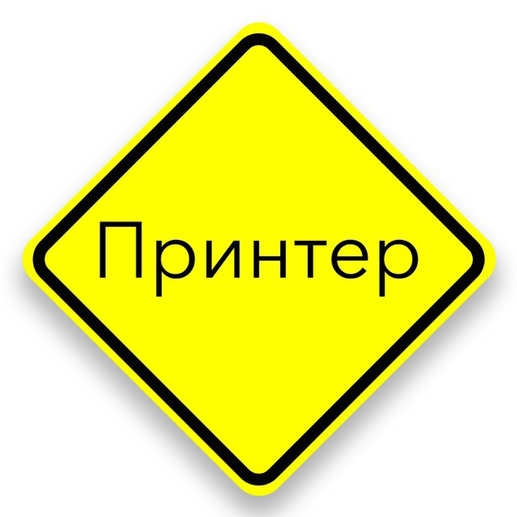

# Инструкция-туториал по разметке MarkDawn  

## Заголовки


## Исходный код 

**В чистом Маркдауне блоки кода отбиваются 4 пробелами в
начале каждой строки.
Но в GitHub-Flavored Markdown (сокращенно GFM) есть
более удобный способ: ставим по три апострофа (на букве
Ё) до и после кода. Также можно указать язык исходного
кода:**


## Таблицы
### Для создания таблицы в Git Markdown используются специальные символы. Вот простейший пример создания таблицы в Git Markdown:

*Вот как будет выглядеть эта таблица:*
| Заголовок 1 | Заголовок 2 |
| --- | --- |
| Строка 1, колонка 1 | Строка 1, колонка 2 |
| Строка 2, колонка 1 | Строка 2, колонка 2 |

### В этом примере создается таблица с двумя заголовками и двумя строками. Заголовки таблицы выделяются символами `|`, разделенными тире (`---`). Каждая строка таблицы начинается и заканчивается символами `|`. Каждый столбец в строке разделяется символами `|`.

*Вот как будет выглядеть эта таблица:*

| Заголовок 1 | Заголовок 2 |
| --- | --- |
| Строка 1, колонка 1 | Строка 1, колонка 2 |
| Строка 2, колонка 1 | Строка 2, колонка 2 |

Вы можете изменить количество заголовков и строк, а также значения в каждой ячейке таблицы в соответствии с вашими нуждами.


## Изображения

**Чтобы добавить изображения, воспользуйтесь следующей командой:**

```

```
Пример:


**Если свое фото - то указываем его название:**



**Если мы хотим добавить изображения-ссылки, то нашу конструкцию нужно сделать такой:**

```
![[альтернативный текст(ссылка)]](Ссылка на другую картинку - наш перевертыш)
```

[](https://plus.unsplash.com/premium_photo-1684923610356-001513e75d62?ixlib=rb-4.0.3&ixid=M3wxMjA3fDB8MHxwaG90by1wYWdlfHx8fGVufDB8fHx8fA%3D%3D&auto=format&fit=crop&w=987&q=80)
<<<<<<< HEAD
=======

 Тесты 
>>>>>>> tables
